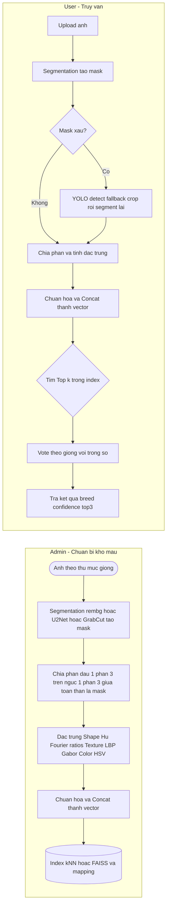
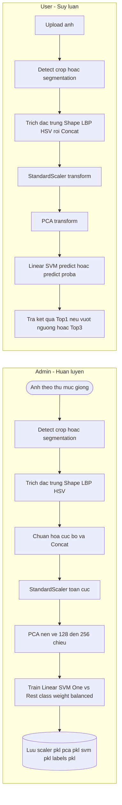

# PawVerse — Nhận diện Giống Thú Cưng: 3 Phương Pháp

Tài liệu này tổng hợp **3 phương pháp** bạn đã chọn để triển khai tính năng nhận diện giống cho PawVerse.  
Mỗi phương pháp đều có **luồng Admin** (chuẩn bị dữ liệu/kho mẫu) và **luồng User** (khi người dùng upload ảnh), kèm **ưu/nhược** và **khi nào nên dùng**.

---

## Tóm tắt nhanh (chọn phương pháp nào?)

| Phương pháp | Ý tưởng chính | Điểm mạnh | Hạn chế | Khi nên dùng |
|---|---|---|---|---|
| **PA1 — YOLOv11 + CLIP + FAISS (retrieval)** | YOLO cắt thú cưng → CLIP embedding (512D) → tìm gần nhất trong FAISS | Dễ triển khai, chính xác & ổn định, thêm giống mới không cần retrain | Cần GPU để nhanh (nhưng CPU vẫn được) | Khi cần độ chính xác thực tế/robust tốt |
| **PA-Alt — Thuần thuật toán (Segmentation-first, Part-aware) + k-NN** | Tách nền → đặc trưng **shape+texture+color** → concat → k-NN/FAISS | Rất nhẹ, chạy CPU tốt, giải thích được | Nhạy ánh sáng/góc chụp, kém robust hơn deep | Khi phần cứng hạn chế/ưu tiên giải thích |
| **PA3 — Feature → PCA → Linear SVM (không retrieval)** | Đặc trưng thủ công → **PCA** nén → **Linear SVM** dự đoán thẳng tên giống | Nhanh, đơn giản, không cần FAISS/CLIP | Cần huấn luyện; kém robust nếu giống rất “na ná” | Dùng làm baseline chắc chắn, API gọn |

---

## Sơ đồ bạn đã vẽ (đã hợp lý)

### PA1 — YOLOv11 + CLIP + FAISS
```mermaid
flowchart LR
  subgraph ADMIN [Admin - Chuan bi kho mau]
    A1([Anh theo thu muc giong])
    A2[YOLOv11 detect + crop (dog/cat)]
    A3[CLIP embed 512D]
    A4[(FAISS index dogs.index va cats.index)]
    A5[(Mapping faiss_id to breed_id to breed_name)]
    A1 --> A2
    A2 --> A3
    A3 --> A4
    A4 --> A5
  end

  subgraph USER [User - Truy van]
    U1[Upload anh]
    U2[YOLOv11 detect + crop (dog/cat)]
    U3[CLIP embed 512D]
    U4{FAISS Top k}
    U5[Quyet dinh Top1 + nguong hoac voting]
    U6[Tra ket qua breed confidence top3]
    U1 --> U2
    U2 --> U3
    U3 --> U4
    U4 --> U5
    U5 --> U6
  end

```

**Điểm cần chốt thêm (nhỏ):**
- Nên tách **index chó** và **index mèo** (YOLO biết `dog`/`cat` → chọn đúng index).  
- Lưu **mapping** `faiss_id → breed_id → breed_name` ở DB/JSON.  
- Quyết định bằng **Top-1 + ngưỡng** *hoặc* **k-NN có trọng số** trên Top-k.  
- CLIP vector nên **L2-normalize**; FAISS dùng **IndexFlatIP** (cosine ≈ inner product sau normalize).

---

### PA-2 — Segmentation-first, Part-aware + k-NN


**Điểm cần chốt thêm (nhỏ):**
- Sau segmentation, **làm sạch mask** (fill holes, morphology).  
- Đặc trưng gợi ý: **Hu + Fourier + ratios** (shape) / **LBP + Gabor** (texture) / **HSV hist** (color).  
- Ghép vector (concat) → chuẩn hoá → **Top-k** và **bầu chọn theo giống** với điểm `S = w1*s_shape + w2*s_texture + w3*s_color`.  
- **YOLO chỉ fallback** khi segmentation thất bại.

---

### PA3 — Feature → PCA → Linear SVM (không retrieval)


**Điểm cần chốt thêm (nhỏ):**
- Trước PCA nên có **StandardScaler** (chuẩn hoá toàn cục) và **lưu scaler + PCA** để dùng lại lúc infer.  
- **Linear SVM (One-vs-Rest)** với `class_weight='balanced'`; có thể **calibrate** để có `confidence`.  
- Inference: trả **Top-1** nếu vượt ngưỡng, hoặc **Top-3** nếu chưa chắc.

---

## Chi tiết từng phương pháp

### 1) PA1 — YOLOv11 + CLIP + FAISS (retrieval)
**Luồng Admin**
1. **Gán nhãn theo thư mục giống** (slug không dấu).  
2. **YOLOv11(n/s)** detect `dog/cat` → **crop** (thêm lề 5–10%).  
3. **CLIP (OpenCLIP ViT-B/32)** → **vector 512D** (L2-normalize).  
4. **Nạp FAISS** (IndexFlatIP) + **mapping** `faiss_id → breed_id`. (Tách **dogs.index** & **cats.index**).

**Luồng User**
1. Nhận ảnh → **YOLO** detect/crop → xác định **species**.  
2. **CLIP** → vector 512D.  
3. **FAISS Top-k** trong index tương ứng → **quyết định** (Top-1 + ngưỡng hoặc voting theo giống).  
4. Trả `{breed, confidence, top3[]}` (một phần tử/bbox nếu nhiều thú cưng).

**Ưu/nhược**: chính xác & mở rộng tốt; phụ thuộc CLIP (GPU nhanh hơn).

---

### 2) PA-Alt — Segmentation-first, Part-aware + k-NN (thuần thuật toán)
**Luồng Admin**
1. **Segmentation** (rembg/U²-Net/GrabCut) → **mask**; làm sạch mask.  
2. **Chia phần**: đầu (1/3 trên), ngực (1/3 giữa), toàn thân (mask).  
3. **Đặc trưng**: Shape (Hu/Fourier/ratios) + Texture (LBP/Gabor) + Color (HSV).  
4. **Concat + chuẩn hoá** → nạp **k-NN/FAISS** + mapping.

**Luồng User**
1. Nhận ảnh → segmentation; nếu hỏng **fallback YOLO** để cắt trước.  
2. Tính cùng loại **đặc trưng** → concat + chuẩn hoá.  
3. **Top-k** → **bầu chọn theo giống** với trọng số từng khối → trả kết quả.

**Ưu/nhược**: chạy CPU tốt, giải thích được; nhạy ánh sáng/góc, kém robust hơn deep.

---

### 3) PA3 — Feature → PCA → Linear SVM (không retrieval)
**Luồng Admin (train)**
1. (Segment/crop) → **đặc trưng**: Shape + LBP + HSV → **concat**.  
2. **StandardScaler** → **PCA** (128–256D) → **train Linear SVM (OVR)** với `class_weight='balanced'`.  
3. (Tùy chọn) **CalibratedClassifierCV** để có `confidence`.  
4. Lưu `scaler.pkl`, `pca.pkl`, `svm.pkl`, `labels.pkl`.

**Luồng User (infer)**
1. (Segment/crop) → tính **feature** → **scaler.transform** → **pca.transform**.  
2. **svm.predict / predict_proba** → **Top-1** (nếu ≥ ngưỡng) hoặc **Top-3**.

**Ưu/nhược**: cực gọn, không cần FAISS; nhưng kém robust nếu lớp nhiều/na ná.

---

## API gợi ý (dùng chung ý tưởng)

- `POST /api/breed/identify` → cho **PA1** hoặc **PA-Alt** (retrieval).  
- `POST /api/breed/identify-linear` → cho **PA3** (SVM không retrieval).  
- `POST /api/breed/index` → build index cho PA1/PA-Alt.  
- `POST /api/breed/train-linear` → train & lưu model cho PA3.

**Response mẫu (PA1/PA-Alt)**
```json
{
  "species": "dog",
  "results": [{"breed":"Shiba Inu","confidence":0.82,
               "top3":[{"breed":"Shiba Inu","score":0.82},
                        {"breed":"Akita Inu","score":0.71},
                        {"breed":"Basenji","score":0.60}]}]
}
```

**Response mẫu (PA3)**  
```json
{
  "results": [
    {"breed":"Shiba Inu","confidence":0.82},
    {"breed":"Akita Inu","confidence":0.63},
    {"breed":"Basenji","confidence":0.55}
  ]
}
```

---

## Đánh giá & chỉnh tham số
- **Top-1/Top-3 accuracy**, **confusion matrix**, **thời gian suy luận**.  
- Chọn **ngưỡng** theo log (vd 0.70–0.80).  
- Với PA-Alt: **grid-search** trọng số `w_shape, w_texture, w_color` và hệ số `α` trong `s_i = exp(-α d_i)`.

---

## Ghi chú nhỏ để tránh lỗi phổ biến
- Ảnh nhiều thú cưng ⇒ trả mảng `results[]`, mỗi phần tử gắn `bbox`/`mask`.  
- Luôn **L2-normalize** vector trước khi cosine/inner-product.  
- Tách **index dogs/cats** để tăng tốc & độ chính xác.  
- Lưu **mapping** đầy đủ để FAISS id → breed name.  
- Với PA3, nhớ **dùng đúng scaler & PCA** đã fit khi chạy infer.

---